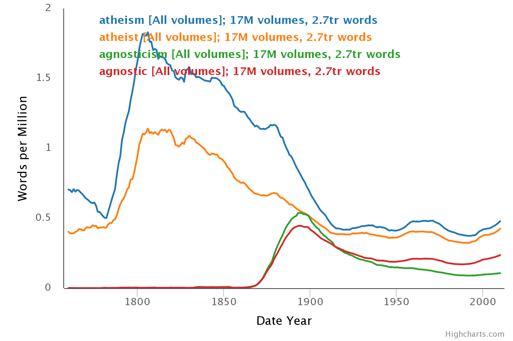

## Source

[HathiTrust Research Center. HathiTrust+Bookworm. Accessed September 3, 2022.](https://bookworm.htrc.illinois.edu.)

## Evaluation

"Bookworm" from HathiTrust is a digital tool which allows users to search the HathiTrust digital library for word counts for any given term or set of terms. This allows users to look up a word and see how often that word occurs each year. According to the project web page, this tool was originally created by Ben Schmidt at Harvard University for Google's Ngram viewer but was adapted for the HathiTrust digital library by Peter Organisciak (Who is now at the University of Denver.)

The basic search feature allows for a number of different filters such as "Fiction or Not Fiction", Genres, Languages, Author, and others. This may allow for more nuanced searching. Users can search for multiple terms but not for bigrams or phrases. For example, you can search for "science" and "fiction" but not "science fiction." This seems somewhat limiting to me.

As a working example, I searched for "atheism," "atheist," "agnosticism," and "agnostic." "Atheism" and "atheist" reach something of a peak a little after 1800 CE whereas "agnosticism" and "agnostic" reach a much smaller peak a little before 1900 CE. It also appears that there is a slight up tick in each term right around 2000 CE. Perhaps most telling is that there is a steep increase in the use of the term "atheism" from about 1770 CE to about 1803 CE. Here is an example of that search:

This tool may have a good use case for cultural historians who want the "big picture" of when various terms are used, how frequently they are used, and if they are used in corelation with other important terms. In the example above, the cultural historian would be alerted to the importance of 1770 CE to 1803 CE in the discourse about atheism. Of course, what this tool does not show is the context in which the term is used. One would have to find a different tool for that.

A strength of this tool is that it is easy to use. There is no software to download or code to write. It is also a strength that with just a few keyboard strokes one can get a big picture of how often a given term has been used in written documents in the past. That said, it is unfortunate that a user cannot search by bigrams or phrases. Adding this capacity would greatly improve the use of this tool for historians and literary scholars.