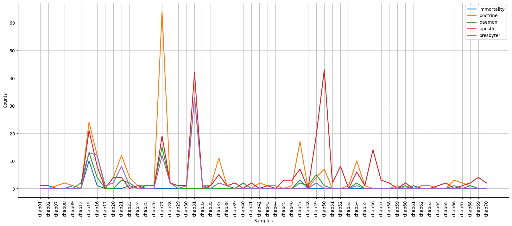

# Exploring Gibbon - Analyze Text


```python
# imports
import json
from sklearn.feature_extraction.text import TfidfVectorizer
import pandas as pd
```


```python
# load data
file_name = 'gibbon_lemmas.json'
with open(file_name, encoding='utf-8', mode='r') as f:
    gibbon_lemmas = json.load(f)
```

## Find the most important words by chapter in Gibbon
For this part we are going to use a library called [scikit-learn](https://scikit-learn.org/stable/). This library is primarily for machine learning, but many of its features are useful for DH work.
Advanced Reading: https://towardsdatascience.com/tf-idf-explained-and-python-sklearn-implementation-b020c5e83275


```python
# The tool I will use here requires a string as input rather than a list, so I convert my docs from lists to strings
gibbon_chap_strings = []
gibbon_chap_names = []
for key, value in gibbon_lemmas.items():
    gibbon_chap_names.append(key)  
    chap_string = ' '.join(value)
    gibbon_chap_strings.append(chap_string)
```


```python
# transform corpus into a matrix of word counts
vectorizer = TfidfVectorizer(max_df=.65, min_df=1, stop_words=None, 
                             use_idf= True, norm=None)
transformed_chaps = vectorizer.fit_transform(gibbon_chap_strings)
transformed_chaps_as_array = transformed_chaps.toarray()
```


```python
gibbon_key_vocab_by_chap = {}
for chap, chap_name in zip(transformed_chaps_as_array, gibbon_chap_names):
    tf_idf_tuples = list(zip(vectorizer.get_feature_names(), chap))
    sorted_tf_idf_tuples = sorted(tf_idf_tuples, key= lambda x: x[1], reverse=True)
    k = chap_name
    v = sorted_tf_idf_tuples[:10]  # only getting the top ten
    gibbon_key_vocab_by_chap[k] = v
```

    C:\Users\msaxto01\Anaconda3\lib\site-packages\sklearn\utils\deprecation.py:87: FutureWarning: Function get_feature_names is deprecated; get_feature_names is deprecated in 1.0 and will be removed in 1.2. Please use get_feature_names_out instead.
      warnings.warn(msg, category=FutureWarning)
    


```python
for k, v in gibbon_key_vocab_by_chap.items():
    result = k + ' => ' + v[0][0] + ', ' + v[1][0] + ', ' + v[2][0] + ', ' + v[3][0] + ', ' + v[4][0]
    print(result)
```

    chap01 => barbarian, comprehend, auxiliary, pilum, cohort
    chap02 => aqueduct, god, provincial, splendour, improvement
    chap03 => commonwealth, consul, constitution, adoption, thing
    chap04 => gladiator, amphitheatre, favourite, beast, amusement
    chap05 => competitor, 13th, superiority, 28th, flatter
    chap06 => excise, mutiny, legacy, tax, taxation
    chap07 => election, game, barbarian, gladiator, other
    chap08 => artaxerxe, satrap, tract, article, universe
    chap09 => barbarian, warrior, reindeer, iron, liquor
    chap10 => barbarian, goth, censor, invader, port
    chap11 => barbarian, queen, coin, supresse, goth
    chap12 => barbarian, interregnum, election, amphitheatre, consul
    chap13 => barbarian, colleague, abdication, mention, painting
    chap14 => constantine, barbarian, superiority, acquaint, levy
    chap15 => doctrine, apostle, presbyter, daemon, immortality
    chap16 => persecution, edict, martyr, martyrdom, sect
    chap17 => praefect, capitation, constantine, consul, indiction
    chap18 => constantine, barbarian, nephew, negotiation, sister
    chap19 => barbarian, obelisk, eunuch, garrison, praefect
    chap20 => constantine, conversion, cross, baptism, labarum
    chap21 => primate, logo, synod, controversy, catholic
    chap22 => tribunal, barbarian, consul, praefect, oblige
    chap23 => god, toleration, rebuild, miracle, persecution
    chap24 => barbarian, sophist, elephant, god, satrap
    chap25 => barbarian, magic, pirate, infantry, praefect
    chap26 => barbarian, goth, emigration, plain, animal
    chap27 => archbishop, barbarian, arbogaste, armour, heretic
    chap28 => martyr, god, relic, idol, miracle
    chap29 => praefect, barbarian, stilicho, count, poet
    chap30 => barbarian, poet, entrenchment, auxiliary, warrior
    chap31 => barbarian, usurper, goth, praefect, constituent
    chap32 => archbishop, barbarian, empress, eunuch, favourite
    chap33 => carthage, vandal, barbarian, sleeper, cavern
    chap34 => barbarian, embassy, deserter, table, interpreter
    chap35 => barbarian, waggon, plain, entrenchment, left
    chap36 => vandal, barbarian, praefect, confederate, oreste
    chap37 => monk, monastery, barbarian, catholic, persecution
    chap38 => barbarian, angle, provincial, diocese, clovis
    chap39 => favor, honor, consul, goth, clamor
    chap40 => blue, silk, green, cupola, worm
    chap41 => vandal, goth, carthage, ditch, departure
    chap42 => chosroe, silk, khan, skin, garrison
    chap43 => honor, comet, plague, goth, valor
    chap44 => civilian, jurisprudence, praetor, honor, decemvir
    chap45 => alboin, exarch, honor, chagan, duke
    chap46 => chosroe, chagan, satrap, elephant, avar
    chap47 => patriarch, synod, honor, heresy, monk
    chap48 => patriarch, dynasty, surname, empress, constantine
    chap49 => pope, exarch, donation, duke, pontiff
    chap50 => prophet, apostle, caliph, camel, angel
    chap51 => caliph, prophet, mosch, abstinence, stipend
    chap52 => caliph, prophet, commander, ommiad, emir
    chap53 => theme, caliph, tactic, silk, tier
    chap54 => paulician, doctrine, reformer, sect, heretic
    chap55 => canoe, baptism, missionary, conversion, emigration
    chap56 => duke, galley, count, admiral, inheritance
    chap57 => sultan, caliph, dynasty, emir, pilgrim
    chap58 => crusader, pilgrim, knight, count, crusade
    chap59 => crusade, sultan, pilgrim, knight, caliph
    chap60 => baron, pilgrim, crusader, doge, marquis
    chap61 => baron, crusade, doge, knight, earl
    chap62 => patriarch, duke, ounce, prelate, vatace
    chap63 => galley, cell, patriarch, elder, regent
    chap64 => sultan, khan, emir, horde, mogul
    chap65 => sultan, emir, cage, khan, vizier
    chap66 => synod, patriarch, pontiff, cardinal, copy
    chap67 => sultan, despot, cardinal, crusade, huniade
    chap68 => sultan, cannon, vizier, bullet, harbour
    chap69 => pope, cardinal, conclave, election, metropolis
    chap70 => cardinal, baron, tribune, pope, conclave
    chap71 => coliseum, arch, amphitheatre, marble, column
    


```python
# explore vocabulary
gibbon_key_vocab_by_chap['chap01']  # <-- you can investigate other chapters
```


    [('barbarian', 24.247456053159887),
     ('comprehend', 16.270300569327112),
     ('auxiliary', 14.002444755199152),
     ('pilum', 12.534161491043836),
     ('cohort', 12.520386983881371),
     ('peninsula', 12.520386983881371),
     ('boundary', 10.28895147073927),
     ('ancient', 9.722308044204258),
     ('tropic', 9.591673732008658),
     ('breadth', 9.32890855939846)]


## Conditional frequency distribution in Gibbon

### Natural Language Toolkit
The **Natural Language Toolkit** (NLTK) is a library used for natural language processing (NLP). If you want to learn more, I highly recommend working through the [NLTK Book](https://www.nltk.org/book/). This resource is a great introduction to NLP specifically and Python more generally.

A **conditional frequency distribution** (cfd) is a collection of word counts for a given condition, i.e. category. Here the category is separate chapters in Gibbon. We can chart what used are used most frequently by chapter. This will tell us something about the nature of each chapter.


```python
import nltk
import matplotlib.pyplot as plt
```


```python
# conditional frequency distribution
# Note: I adapted these lines of code from the NLTK
key_words = ['doctrine', 'apostle', 'presbyter', 'daemon', 'immortality']  # <-- instert token(s) to explore (lowercase)
cfd = nltk.ConditionalFreqDist(
    (key_word, chap_name)
    for chap_name in gibbon_lemmas.keys()
    for lemma in gibbon_lemmas[chap_name]
    for key_word in key_words
    if lemma.lower().startswith(key_word)
)
# display plot
plt.figure(figsize=(20, 8))  # this expands the plot to make it more readable
cfd.plot()
```


    

    


    <AxesSubplot:xlabel='Samples', ylabel='Counts'>


```python
# save figure as png
plt.savefig('../figures/kw_by_chap.png')
# save as pdf
plt.savefig('../figures/kw_by_chap.pfd')
```

### Activity
Based on the key vocabulary by chapter above, explore the use of different terms in the conditional frequency distribution. 
* What questions about the text does this raise for you?
* What hypotheses about the text can you form?

